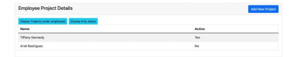

MILESTONE 4 GROUP 60 

Tushrima Kelshikar Gursmeep Syan 

Our group had decided to design a database application for an automated payroll system which focuses on storing and keeping a track of personal employee information especially the payroll slips. There are entities such as name email ID, password, employee ID, age, address, contact number and the payroll slip will have information on number of hours worked during the pay cycle, hourly wage rate, bank details. 

The different classes of users of the system are the employee and the managers/HR where the IS-A relationship of employees isn’t fully covered by just HR or manager. The employees will have access and will be able to update their personal details. The managers will be able to accurately register the clock in and clock out times (number of hours worked by each employee), HR will be able to produce the payroll. The payroll will only be editable by the HR/Manager and the employees will have view- only access to it.  

To implement this application into a GUI , we used the instructions given by the professor about MySQL and PHP platforms using phpadmin software. We were able to mimic UI pages such as Login, Home page , Project info page etc. to help the user get a brief hint of how the system works. We also created a database with all the populated tables of info regarding out schema. The biggest accomplishment from our application is that we were able to see how to create a working application which can be applied to any number of small/large businesses to help keep track of the employee info and send out pay checks as per the working hours of the employees. 

The change in our schema from when we started was quite significant. We added 3 new entities which in turn had 7 new relationships created and 4 of these relationships were many-to-one. We also had to edit the primary and foreign keys for some of the tables to get the information meaningfully across and be able to populate the sql part of the application. 

Below are the screenshots of the queries we applied and how they changed the data before and after their application. 

This is the Home page with employee table with an extra column for “Action” User can “View” ”Edit” ”Delete” the employee info in the table and can also Add a new entry into the table. 

Here is an example of clicking “Add Employees” 

There is also the option of delete the record : 

The other option is of updating the employee information : 

The Blue buttons above represent the queries which we made on the tables. We displayed as much queries on as few tables as possible for a better UI experience for the user. 

1. Select Age – Refers to normal select query where we select employees above age 25 

2. Display address – Refers to the projection 

3. Display seniormost employee – Refers to the aggregation query using MAX() 

4. Display all employees that worked on all projects – Refers to the division query (the result is no record found as there were no such employees) 

Here is the other table of the Project Details with 2 new blue buttons referring to 2 new queries (contd. From number 4 above) 

5. Display Projects under employees – Refers to the JOIN query on employee table and project table based on an inner join on employee ID  

6. Display # by status – Refers to the Groupby query to show number of projects under different activity statuses  

